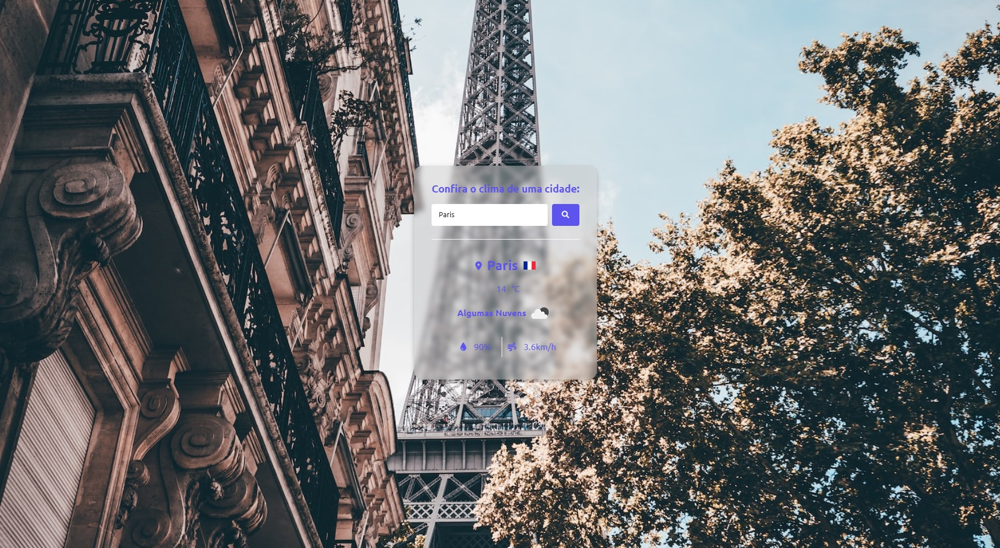

# Aplicativo_Clima

Aplicativo para conferir clima pesquisando por cidades do mundo todo, utilizando API para trazer os dados climáticos! 

Projeto desenvolvido na aula do Matheus Battisti (Comunidade Hora de Codar)

## Tecnicas e ferramentas utilizadas
 
- ``HTML``
- ``CSS``
- ``JavaScript`` 
- ``Configuração de APIs`` 
- ``OpenWeather API`` 

